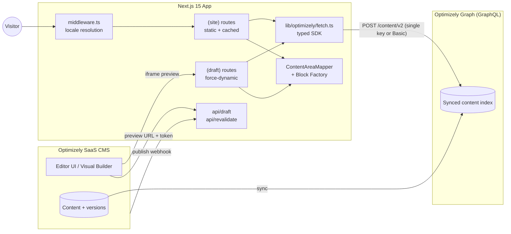
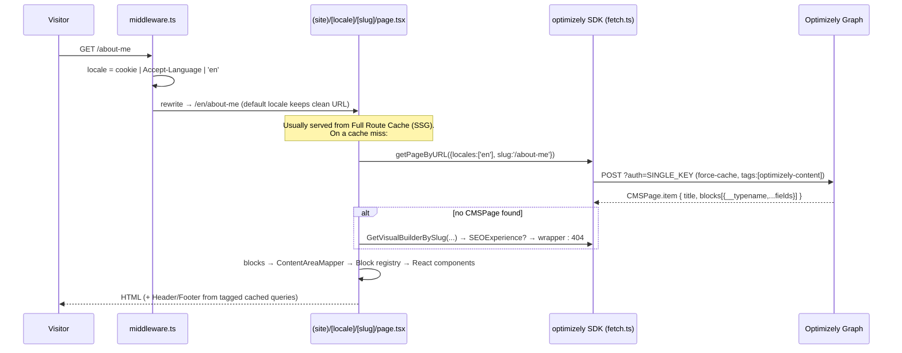
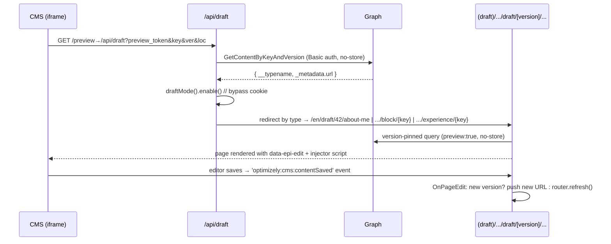
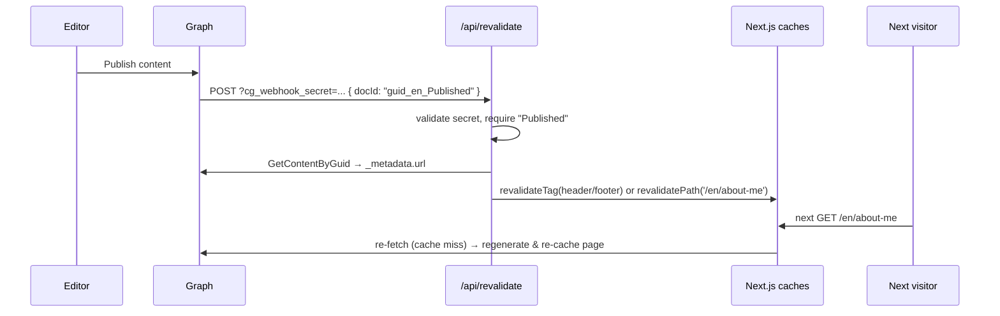

# Optimizely SaaS CMS + Next.js 15 — Complete Study Guide

A comprehensive, module-by-module guide to this Optimizely SaaS CMS frontend built with **Next.js 15 (App Router)**. It explains how the Optimizely CMS works, how every module of this codebase fits together, how data flows from the CMS to the rendered page, and how to extend the project with new features.

> Based on the [Opti Masterclass](https://opti-masterclass.vercel.app) starter template ([szymonuryga/Optimizely-SaaS-CMS-Next.js-15](https://github.com/szymonuryga/Optimizely-SaaS-CMS-Next.js-15)). This template requires an Optimizely SaaS CMS instance to retrieve content.

> **This instance has been converted into Rasel Hasan's personal blog.** The portfolio blocks described in Module 6 below have been deleted, the homepage is now a `BlogPost` listing rather than a CMS `StartPage`, and locales are reduced to `en`. See [docs/blog-architecture.md](docs/blog-architecture.md) for the blog-specific architecture and [docs/blog-body-structure.md](docs/blog-body-structure.md) for the rich-text schema. The rest of this guide still describes the underlying CMSPage/Visual Builder/draft-mode machinery accurately — that infrastructure was kept, not removed.

---

## Table of Contents

1. [What This Project Is](#1-what-this-project-is)
2. [Optimizely SaaS CMS Primer](#2-optimizely-saas-cms-primer)
3. [Repository Map](#3-repository-map)
4. [Architecture at a Glance](#4-architecture-at-a-glance)
5. [Modules In Depth](#5-modules-in-depth)
   - [Module 1 — Configuration & Environment](#module-1--configuration--environment)
   - [Module 2 — Data Layer (`lib/optimizely`)](#module-2--data-layer-liboptimizely)
   - [Module 3 — Localization, Middleware & Security Headers](#module-3--localization-middleware--security-headers)
   - [Module 4 — Routing & Pages (`app/(site)`)](#module-4--routing--pages-appsite)
   - [Module 5 — Rendering Engine: Block Factory & Content Area Mapper](#module-5--rendering-engine-block-factory--content-area-mapper)
   - [Module 6 — Blocks Library (removed)](#module-6--blocks-library-removed)
   - [Module 7 — Layout Components (Header / Footer)](#module-7--layout-components-header--footer)
   - [Module 8 — Visual Builder (Experiences)](#module-8--visual-builder-experiences)
   - [Module 9 — Draft Mode & Live Preview (`app/(draft)`)](#module-9--draft-mode--live-preview-appdraft)
   - [Module 10 — Caching & On-Demand Revalidation](#module-10--caching--on-demand-revalidation)
   - [Module 11 — SEO & Metadata](#module-11--seo--metadata)
   - [Module 12 — Image Handling](#module-12--image-handling)
   - [Module 13 — UI Foundation (shadcn/ui + Tailwind)](#module-13--ui-foundation-shadcnui--tailwind)
6. [Data Flow, End to End](#6-data-flow-end-to-end)
7. [How to Add New Features](#7-how-to-add-new-features)
8. [Suggested Study Path](#8-suggested-study-path)
9. [Gotchas & Troubleshooting](#9-gotchas--troubleshooting)
10. [Security Considerations](#10-security-considerations)
11. [Getting Started (Setup)](#11-getting-started-setup)
12. [Reference](#12-reference)

---

## 1. What This Project Is

A **headless CMS frontend**: all content (pages, blocks, navigation, experiences) lives in **Optimizely SaaS CMS** and is delivered to this app through **Optimizely Graph** (a GraphQL API). The app statically generates pages, keeps them fresh with webhook-driven cache revalidation, and gives editors a live in-CMS preview and Visual Builder editing experience.

| Concern            | Technology                                                         |
| ------------------ | ------------------------------------------------------------------ |
| Framework          | Next.js 15 (App Router, React Server Components, React 19)         |
| Content API        | Optimizely Graph (GraphQL over the CMS content index)              |
| Type safety        | GraphQL Codegen → generated TypeScript types + typed SDK           |
| Rendering strategy | Static Site Generation (SSG) + on-demand revalidation via webhooks |
| Editor experience  | Next.js Draft Mode + Optimizely preview iframe + Visual Builder    |
| Localization       | Path-based locale (`en` only) resolved in middleware               |
| Styling / UI       | Tailwind CSS + shadcn/ui (Radix primitives)                        |
| Images             | `next/image` with a custom Cloudinary-aware loader                 |

**Core idea to keep in mind while studying:** the CMS decides _what_ content exists and in what order; this app decides _how_ each content type renders. The bridge between the two is the GraphQL `__typename` of each content item, which is mapped to a React component through the Block Factory pattern.

---

## 2. Optimizely SaaS CMS Primer

Concepts you need before the code makes sense.

### 2.1 SaaS CMS and Optimizely Graph

- **Optimizely SaaS CMS** is the fully hosted version of Optimizely's CMS. You model content types and author content in the CMS UI (`https://app-....cms.optimizely.com`). There is no .NET code to deploy — the frontend is _whatever you build_, this repo being one.
- **Optimizely Graph** (a.k.a. Content Graph, `https://cg.optimizely.com/content/v2`) is a hosted GraphQL service. The CMS continuously syncs published _and_ draft content into Graph's search index; your frontend queries Graph, never the CMS directly.
- Every content type you define in the CMS (e.g. `HeroBlock`, `CMSPage`) automatically becomes a GraphQL type with queryable fields.

### 2.2 Authentication modes

| Mode             | Credential                                               | Used for                                                     |
| ---------------- | -------------------------------------------------------- | ------------------------------------------------------------ |
| **Single key**   | `?auth=<OPTIMIZELY_SINGLE_KEY>` query param              | Public, _published-only_ content reads                       |
| **HMAC / Basic** | `Authorization: Basic <base64(AppKey:AppSecret)>` header | Privileged reads that include **draft/unpublished versions** |

This project uses the single key for all normal page rendering and the Basic header (from `OPTIMIZELY_PREVIEW_SECRET`) whenever `preview: true` is passed to the fetch layer.

### 2.3 The content model

- **Pages** — routable content with a URL (here: `StartPage`, `CMSPage`).
- **Blocks / Components** — non-routable content composed _into_ pages (here: `HeroBlock`, `ServicesBlock`, …). A page holds them in a **content area** property (`blocks`).
- **Experiences** — pages built visually in **Visual Builder** (here: `SEOExperience`). Instead of a flat `blocks` list they store a **composition tree**: sections → rows → columns → elements, where each element wraps a component.
- **Shared settings content** — this project models the site `Header` and `Footer` as standalone content items fetched separately.

### 2.4 `_metadata` — the system fields

Every item in Graph exposes `_metadata`, and this project leans on it heavily:

| Field              | Meaning                                                 | Where it's used                       |
| ------------------ | ------------------------------------------------------- | ------------------------------------- |
| `key`              | GUID identity of the content                            | Preview deep-links, webhook lookups   |
| `version`          | Version number (each save creates a new draft version)  | Draft mode picks the highest version  |
| `locale`           | Language branch                                         | All queries filter by locale          |
| `types`            | Type ancestry (e.g. `['CMSPage', '_Page', '_Content']`) | `AllPages` query filters by type      |
| `url.default`      | The routable URL segment (e.g. `/about-me`)             | Page lookup by slug                   |
| `url.hierarchical` | Full tree path (e.g. `/start-page/about-me/`)           | Preview + webhook URL resolution      |
| `url.type`         | `SIMPLE` or `HIERARCHICAL` routing                      | Webhook picks which URL to revalidate |
| `status`           | e.g. `Published`                                        | Webhook only reacts to published docs |

### 2.5 Versions, drafts, publishing

Editing content in the CMS creates a new **version** in draft status. Graph indexes drafts too, but they are only visible to privileged (Basic-auth) queries. Publishing flips the status and fires **webhooks** (`docId` format: `<guid>_<locale>_Published`) — which this app uses to invalidate its static cache.

### 2.6 The Start Page and hierarchical routing quirk

In Optimizely's hierarchical routing the Start Page is **not** hosted at `/`. It has its own URL like `/start-page`, and children live under it (`/start-page/about-me`). The frontend, however, wants clean URLs (`/about-me`). That's why `OPTIMIZELY_START_PAGE_URL` exists — the preview and revalidation code strips this prefix to normalize CMS URLs to site URLs. Miss this and preview/revalidation break in confusing ways.

---

## 3. Repository Map

```
├── app/
│   ├── (site)/[locale]/              # PUBLIC site (static, cached)
│   │   ├── layout.tsx                #   Root layout: fonts, <Header/>, <Footer/>
│   │   ├── page.tsx                  #   Home page → StartPage content
│   │   ├── [slug]/page.tsx           #   Catch-all CMS page → CMSPage | SEOExperience
│   │   └── not-found.tsx             #   404 UI
│   ├── (draft)/[locale]/             # EDITOR preview (dynamic, never cached)
│   │   ├── layout.tsx                #   Injects CMS communicationinjector.js + DraftActions
│   │   └── draft/[version]/
│   │       ├── page.tsx              #   Start page preview (version-pinned)
│   │       ├── [slug]/page.tsx       #   CMS page preview (version-pinned)
│   │       ├── block/[key]/page.tsx  #   Single block preview
│   │       └── experience/[key]/page.tsx  # Visual Builder experience preview
│   └── api/
│       ├── draft/route.ts            # Preview entry point called by the CMS
│       ├── draft/disable/route.ts    # Exits draft mode
│       └── revalidate/route.ts       # Webhook receiver → cache invalidation
├── components/
│   ├── block/                        # One React component per CMS block type
│   ├── content-area/                 # mapper.tsx + block.tsx (the rendering engine)
│   ├── draft/                        # Draft-mode helper components
│   ├── layout/                       # Header, Footer, LanguageSwitcher
│   ├── visual-builder/wrapper.tsx    # Renders experience composition trees
│   └── ui/                           # shadcn/ui primitives (button, card, …)
├── lib/
│   ├── optimizely/
│   │   ├── fetch.ts                  # GraphQL client + typed SDK wiring
│   │   ├── queries/                  # *.graphql documents (published)
│   │   │   ├── draft/                # *.graphql documents (preview/versions)
│   │   │   └── fragments/Block.graphql  # Block fragments + ItemsInContentArea
│   │   ├── types/
│   │   │   ├── generated.ts          # ⚙️ GraphQL Codegen output (types + SDK)
│   │   │   ├── experience.ts         # Visual Builder composition types
│   │   │   ├── typeUtils.ts          # castContent() runtime type guard
│   │   │   └── block.ts              # BlockBase shared props
│   │   └── utils/language.ts         # LOCALES, getValidLocale, path helpers
│   ├── image/loader.ts               # Custom next/image loader (Cloudinary)
│   ├── utils/                        # metadata.ts, draft-mode.ts, block-factory.tsx
│   ├── utils.ts                      # cn(), createUrl(), leadingSlashUrlPath()
│   └── type-guards.ts                # Error narrowing helpers
├── middleware.ts                     # Locale detection, rewrite/redirect
├── codegen.yaml                      # GraphQL Codegen config
├── next.config.ts                    # Images, security headers, /preview redirect
├── ExportedFile.episerverdata        # Importable CMS content (content types + pages)
└── docs/                             # Original topic deep-dives (see References)
```

---

## 4. Architecture at a Glance



Two parallel worlds render the same content with the same components:

|               | `(site)` route group                        | `(draft)` route group                                |
| ------------- | ------------------------------------------- | ---------------------------------------------------- |
| Audience      | Visitors                                    | Editors inside the CMS iframe                        |
| Caching       | `force-cache` + SSG, revalidated by webhook | `force-dynamic`, `revalidate = 0`, `no-store`        |
| Auth to Graph | Single key (published only)                 | Basic secret (`preview: true`, sees drafts)          |
| Version       | Latest published                            | Pinned to `[version]` URL segment                    |
| Extra         | —                                           | `communicationinjector.js`, `data-epi-edit` bindings |

Route groups `(site)` and `(draft)` don't appear in URLs — `/en/about` hits `(site)`, `/en/draft/42/about` hits `(draft)`. Each group has its **own root layout**, which is how draft pages avoid the cached Header/Footer and gain the CMS communication script.

---

## 5. Modules In Depth

### Module 1 — Configuration & Environment

**Files:** [.env.example](.env.example), [next.config.ts](next.config.ts), [codegen.yaml](codegen.yaml), [tsconfig.json](tsconfig.json)

Environment variables (all consumed server-side except the public CMS URL):

| Variable                       | Purpose                                                                                 | Used in                                                                                |
| ------------------------------ | --------------------------------------------------------------------------------------- | -------------------------------------------------------------------------------------- |
| `OPTIMIZELY_API_URL`           | Graph endpoint, typically `https://cg.optimizely.com/content/v2`                        | [fetch.ts](lib/optimizely/fetch.ts), codegen                                           |
| `OPTIMIZELY_SINGLE_KEY`        | Public read key, appended as `?auth=`                                                   | [fetch.ts](lib/optimizely/fetch.ts), codegen                                           |
| `OPTIMIZELY_PREVIEW_SECRET`    | `base64(AppKey:AppSecret)` for Basic auth; unlocks draft content                        | [fetch.ts:36](lib/optimizely/fetch.ts)                                                 |
| `OPTIMIZELY_REVALIDATE_SECRET` | Shared secret the webhook must present                                                  | [revalidate route](app/api/revalidate/route.ts)                                        |
| `OPTIMIZELY_START_PAGE_URL`    | Hierarchical URL of the Start Page (e.g. `/start-page`), stripped when normalizing URLs | [draft route](app/api/draft/route.ts), [revalidate route](app/api/revalidate/route.ts) |
| `NEXT_PUBLIC_CMS_URL`          | CMS instance origin; loads `communicationinjector.js` in draft layout                   | [(draft) layout](<app/(draft)/[locale]/layout.tsx>)                                    |

Key `next.config.ts` decisions:

- **Custom image loader** (`loader: 'custom'`, `loaderFile: './lib/image/loader.ts'`) — see Module 12.
- **Security headers**: `X-Frame-Options: SAMEORIGIN` plus `Content-Security-Policy: frame-ancestors 'self' *.optimizely.com`. The CMS previews your site inside an iframe — this allows _only_ Optimizely (and same-origin) to embed it.
- **Redirect** `/preview/:path* → /api/draft:path*` — lets you configure the CMS preview URL as `/preview` while the real handler lives at `/api/draft` (query params are preserved on redirect).

`codegen.yaml` points at the live Graph schema (URL + single key from env), collects every `lib/optimizely/queries/**/*.graphql` document, and generates [generated.ts](lib/optimizely/types/generated.ts) using three plugins: `typescript` (schema types), `typescript-operations` (per-query result/variable types), and `typescript-generic-sdk` (a `getSdk()` factory exposing one typed method per query). `avoidOptionals: true` makes nullable fields explicit `| null` instead of `?`, forcing you to handle nulls.

`tsconfig.json` maps `@/*` to the repo root — that's the import alias you see everywhere.

### Module 2 — Data Layer (`lib/optimizely`)

**Files:** [fetch.ts](lib/optimizely/fetch.ts), [queries/](lib/optimizely/queries), [types/generated.ts](lib/optimizely/types/generated.ts), [types/typeUtils.ts](lib/optimizely/types/typeUtils.ts), [utils/language.ts](lib/optimizely/utils/language.ts)

This is the single chokepoint between the app and Optimizely Graph. Nothing else does I/O.

**`optimizelyFetch()`** ([fetch.ts:23](lib/optimizely/fetch.ts)) wraps the native `fetch` with:

1. **Endpoint + auth** — `POST {OPTIMIZELY_API_URL}?auth={OPTIMIZELY_SINGLE_KEY}` with the GraphQL `{ query, variables }` body.
2. **Preview switch** — when `preview: true`, it adds `Authorization: Basic {OPTIMIZELY_PREVIEW_SECRET}` and forces `cache: 'no-store'` (drafts must never be cached).
3. **Cache defaults** — otherwise `cache: 'force-cache'`: every Graph response enters the Next.js **Data Cache** indefinitely until invalidated.
4. **Cache tags** — every request is tagged `optimizely-content`, plus an optional per-call tag (`optimizely-header`, `optimizely-footer`). Tags are the handles that on-demand revalidation pulls (Module 10).
5. **Error normalization** — network errors are rethrown as `{ status, message, query }` via [type-guards.ts](lib/type-guards.ts).

**The typed SDK** — the exported `optimizely` object ([fetch.ts:100](lib/optimizely/fetch.ts)) comes from `getSdk(requester)`. Codegen turns _every_ `.graphql` document into a method: `optimizely.GetStartPage({ locales })`, `optimizely.getPageByURL({ locales, slug })`, etc. The `requester` bridges SDK calls into `optimizelyFetch`, so every call site gets full typing **and** the caching/preview behavior for free:

```ts
const { data } = await optimizely.getPageByURL(
  { locales: ['en'], slug: '/about-me' }, // typed variables
  { preview: false, cacheTag: 'something' } // OptimizelyFetchOptions
)
```

**Query organization** (`lib/optimizely/queries/`):

| Document                        | Purpose                                                                                                                                                                                                                                                                                                |
| ------------------------------- | ------------------------------------------------------------------------------------------------------------------------------------------------------------------------------------------------------------------------------------------------------------------------------------------------------ |
| `GetStartPage` / `getPageByURL` | Published home / page-by-slug with `blocks { ...ItemsInContentArea }`                                                                                                                                                                                                                                  |
| `GetVisualBuilderBySlug`        | Published `SEOExperience` with the full composition tree                                                                                                                                                                                                                                               |
| `AllPages`                      | Every `CMSPage`/`SEOExperience` URL — feeds `generateStaticParams`                                                                                                                                                                                                                                     |
| `getHeader` / `getFooter`       | Shared layout content                                                                                                                                                                                                                                                                                  |
| `GetContentByGuid`              | Webhook: GUID → URL metadata                                                                                                                                                                                                                                                                           |
| `draft/*`                       | Preview equivalents: version-pinned (`GetPreviewStartPage`, `getPreviewPageByURL`, `GetComponentByKey`, `VisualBuilder`) or all-versions (`GetAllStartPageVersions`, `GetAllPagesVersionByURL`, `GetAllVisualBuilderVesrionsBySlug`), plus `GetContentByKeyAndVersion` used by the preview entry route |
| `fragments/Block.graphql`       | One fragment per block type + the umbrella `ItemsInContentArea` fragment                                                                                                                                                                                                                               |

**`ItemsInContentArea` is the most important fragment in the repo.** It spreads every block fragment over the `_IContent` interface:

```graphql
fragment ItemsInContentArea on _IContent {
  __typename
  ...HeroBlockFragment
  ...ContactBlockFragment
  # ...every other block fragment
}
```

Any content area queried with it returns each item's `__typename` plus that block's fields — exactly the shape the Block Factory needs. **When you add a new block type, you must extend this fragment** or your block arrives as an empty object.

**`castContent<T>()`** ([typeUtils.ts](lib/optimizely/types/typeUtils.ts)) — content areas are typed as broad `_IContent` unions. This helper narrows at runtime by comparing `__typename`, returning the typed item or `null`:

```ts
const service = castContent<ServiceItem>(serviceItem, 'ServiceItem')
if (!service) return null
```

**Language utils** ([utils/language.ts](lib/optimizely/utils/language.ts)) — `LOCALES = ['en', 'pl', 'sv']`, `DEFAULT_LOCALE = 'en'`, `getValidLocale()` coerces arbitrary strings to a supported `Locales` enum value, and `mapPathWithoutLocale()` strips a leading locale segment from CMS URLs.

### Module 3 — Localization, Middleware & Security Headers

**Files:** [middleware.ts](middleware.ts)

`LOCALES` is now just `['en']` (the blog is English-only), but the locale-rewrite plumbing was kept rather than deleted, since it's cheap to keep working and other locales can be re-added by extending the array again — no route code depends on there being more than one. The language switcher UI was removed since there is nothing to switch to.

Every request (except `/api/*`, Next internals, and files with extensions — see the `matcher` and `shouldExclude`) passes through the middleware, which guarantees that route handlers always see a `[locale]` param:

1. **URL already contains a supported locale** (`/en/about`) → **rewrite** to itself (normalized), set the `__LOCALE_NAME` cookie and append an `X-Locale` response header.
2. **No locale in URL** (`/about`) → resolve one:
   - cookie `__LOCALE_NAME` if valid, else
   - `Accept-Language` negotiation via `negotiator` (exact match first, then language prefix), else
   - `DEFAULT_LOCALE`.
3. **Default locale → rewrite** (URL stays `/about`, internally serves `/en/about`). **Non-default → redirect.**

**To render localized content**, every Graph query takes a `locales` variable — locale is a _query filter_ in Graph, not a different endpoint.

**Security headers** are also set here rather than in `next.config.ts`, because the Content-Security-Policy needs to differ between the `(draft)` route group (relaxed — the CMS's `communicationinjector.js` script and Visual Builder need to iframe those routes) and everywhere else (locked down). `next.config.ts`'s static `headers()` can't express that split without risking two `Content-Security-Policy` response headers landing on the same request — browsers intersect multiple CSP headers into the most restrictive one, which would silently defeat the relaxed override. The CSP currently ships as `Content-Security-Policy-Report-Only`, not enforcing: a strict `script-src 'self'` blocks Next's own App Router RSC hydration scripts (confirmed against both dev and production builds — the page rendered blank), and a nonce + `'strict-dynamic'` per Next's documented CSP pattern didn't get picked up by Next's renderer in this setup. `X-Content-Type-Options`, `Referrer-Policy`, `Strict-Transport-Security`, and `X-Frame-Options` (skipped on draft routes) are fully enforced — they carry no such risk.

### Module 4 — Routing & Pages (`app/(site)`)

**Files:** [layout.tsx](<app/(site)/[locale]/layout.tsx>), [page.tsx](<app/(site)/[locale]/page.tsx>), [blog/[slug]/page.tsx](<app/(site)/[locale]/blog/[slug]/page.tsx>), [[slug]/page.tsx](<app/(site)/[locale]/[slug]/page.tsx>), [not-found.tsx](<app/(site)/[locale]/not-found.tsx>)

**Root layout** — loads Geist fonts, renders `<Header/>` and `<Footer/>` (each fetching its own CMS content), and pre-generates one static shell per locale via `generateStaticParams()`.

**Home page (`/[locale]`)** — the blog listing, not a CMS page type (there is no listing content type). `getAllPublishedPosts()` (`lib/blog/posts.ts`) fetches all `BlogPost` items, sorts them by parsed `publishedDate` in code (Graph has no `orderBy` for that field — see [docs/blog-body-structure.md](docs/blog-body-structure.md)), and renders one `<PostCard/>` per post. Empty when nothing is published yet — that's expected, not a bug.

**Article page (`/[locale]/blog/[slug]`)** — see [docs/blog-architecture.md](docs/blog-architecture.md) for the full data flow: URL construction, rich-text rendering, and the draft-mode branch.

**Catch-all page (`/[locale]/[slug]`)** — unchanged, still serves CMSPage/SEOExperience content (e.g. `/about`). One route serves **two page paradigms**:

```
getPageByURL(slug)               ── found? ──▶ render CMSPage.blocks
   │ errors or no item
   ▼
GetVisualBuilderBySlug(slug)     ── found? ──▶ render SEOExperience composition
   │ neither
   ▼
notFound() → 404
```

- `generateStaticParams()` calls `AllPages(pageType: ['CMSPage', 'SEOExperience'])`, strips locale prefixes with `mapPathWithoutLocale`, dedupes, and returns slugs — so **every CMS page is statically pre-rendered at build time**.
- Note the slug is a _single_ segment (`[slug]`, not `[...slug]`) — this template assumes a flat URL space under the start page. Nesting deeper requires switching to a catch-all segment (see Recipes).

Published pages are **never fetched per-request** after build: the page HTML and the underlying Graph responses live in Next's caches until a webhook invalidates them.

### Module 5 — Rendering Engine: Block Factory & Content Area Mapper

**Files:** [components/content-area/mapper.tsx](components/content-area/mapper.tsx), [components/content-area/block.tsx](components/content-area/block.tsx), [lib/utils/block-factory.tsx](lib/utils/block-factory.tsx), [lib/optimizely/types/block.ts](lib/optimizely/types/block.ts)

The pattern that turns CMS JSON into React trees. Three layers:

**1. `blocksMapperFactory` (generic factory)** — takes a `{ TypeName: Component }` map and returns a `factory({ typeName, props })` function that `createElement`s the matching component, or returns `null` for unknown types (graceful degradation when the CMS has types the frontend doesn't know yet). TypeScript infers `props` from the component the `typeName` points at.

**2. `Block` (the registry)** ([block.tsx](components/content-area/block.tsx)) — the only file that knows the full block catalog. Each block is loaded with `next/dynamic` so its JS is code-split and only shipped when a page actually uses it:

```tsx
const HeroBlock = dynamic(() => import('../block/hero-block'))
// ...
export const blocks = { AvailabilityBlock, ContactBlock, HeroBlock, ... } as const
export default blocksMapperFactory(blocks)
```

**Map keys must equal GraphQL `__typename`s exactly** — that string equality is the entire wiring.

**3. `ContentAreaMapper` (the iterator)** ([mapper.tsx](components/content-area/mapper.tsx)) — receives either:

- `blocks` (flat content area): maps each item, spreading its fields as props plus `isFirst` (index 0 — handy for hero priority images) and `preview`; or
- `experienceElements` with `isVisualBuilder` (Visual Builder columns): same idea, but each element is wrapped in `<div data-epi-block-id={key}>` so Visual Builder can highlight/select it, and `displaySettings` are forwarded as props.

[BlockBase](lib/optimizely/types/block.ts) documents the extra props every block implicitly receives (`isFirst`, `preview`, `displaySettings`).

### Module 6 — Blocks Library (removed)

**Files:** none — `components/block/` is gone.

The portfolio template shipped nine block components (`HeroBlock`, `StoryBlock`, `ServicesBlock`, `PortfolioGridBlock`, `TestimonialsBlock`, `LogosBlock`, `ProfileBlock`, `AvailabilityBlock`, `ContactBlock`), all deleted for the blog conversion along with their fragments in `lib/optimizely/queries/fragments/Block.graphql` and their registry entries in `components/content-area/block.tsx`. The **mapper/factory infrastructure from Module 5 was kept** — `blocks` in `block.tsx` is now `{}`, and `blocksMapperFactory` returns `null` for any `__typename` it doesn't recognize, so CMSPage and Visual Builder content areas still work, they just render nothing for these removed types. The CMS still has the underlying content types and content published; only the frontend code was removed (safe — the CMS side is a separate cleanup task, not required for this to work).

If you're re-adding a block type, the conventions that applied before still apply: props from generated types, `castContent` to narrow nested unions, `data-epi-edit="propName"` for CMS-editable regions, null-tolerant rendering.

### Module 7 — Layout Components (Header / Footer)

**Files:** [components/layout/header.tsx](components/layout/header.tsx), [components/layout/footer.tsx](components/layout/footer.tsx)

Both are **server components that fetch their own content** — the layout doesn't thread data down:

```ts
const { data } = await optimizely.getHeader(
  { locale: locales },
  { cacheTag: 'optimizely-header' }
)
```

The dedicated `cacheTag` matters: header/footer responses are shared by _every_ page, so when an editor publishes a navigation change, the webhook calls `revalidateTag('optimizely-header')` once instead of revalidating every path (Module 10).

Both components narrow nested items (`NavItem`, `FooterColumn`, `SocialLink`) with `castContent`. The footer maps a CMS string (`platform`) to an icon component in [ui/icons.tsx](components/ui/icons.tsx).

### Module 8 — Visual Builder (Experiences)

**Files:** [components/visual-builder/wrapper.tsx](components/visual-builder/wrapper.tsx), [lib/optimizely/types/experience.ts](lib/optimizely/types/experience.ts), [GetVisualBuilderBySlug.graphql](lib/optimizely/queries/GetVisualBuilderBySlug.graphql)

Visual Builder pages (`SEOExperience`) don't have a flat `blocks` list — they have a **composition**: a recursive node tree the editor arranges by drag & drop.

```
composition
└── nodes[] (top level)
    ├── nodeType: 'section'  → rows[] → columns[] → elements[] → { component }
    └── nodeType: 'component' → { component }          (a block dropped at top level)
```

The GraphQL query flattens this with aliases (`rows: nodes`, `columns: nodes`, `elements: nodes`) and inline fragments on `CompositionStructureNode` / `CompositionComponentNode`; each leaf component is fetched with the same `ItemsInContentArea` fragment — **so any block works in both classic content areas and Visual Builder without extra code**.

[VisualBuilderExperienceWrapper](components/visual-builder/wrapper.tsx) walks the tree: sections become flex containers (`vb:grid`/`vb:row`/`vb:col` are marker class names for debugging, not Tailwind utilities), columns delegate to `ContentAreaMapper` in `isVisualBuilder` mode, and every section/component gets `data-epi-block-id={key}` so the Visual Builder overlay can map DOM → content.

[SafeVisualBuilderExperience](lib/optimizely/types/experience.ts) exists because codegen types deep recursive JSON loosely; it overlays a hand-written composition shape on the generated `SeoExperience`.

### Module 9 — Draft Mode & Live Preview (`app/(draft)`)

**Files:** [app/api/draft/route.ts](app/api/draft/route.ts), [app/api/draft/disable/route.ts](app/api/draft/disable/route.ts), [(draft) layout](<app/(draft)/[locale]/layout.tsx>), [draft/[version] pages](<app/(draft)/[locale]/draft/[version]>), [components/draft/\*](components/draft), [lib/utils/draft-mode.ts](lib/utils/draft-mode.ts)

This is how editors see unpublished work inside the CMS.

**Entry flow.** In the CMS, the application's preview URL is configured to hit this app (`/preview` → redirected to `/api/draft`) with query params `preview_token`, `key` (content GUID), `ver` (version), `loc` (locale). The [draft route](app/api/draft/route.ts):

1. Rejects requests missing `ver`/`token`/`key`.
2. Looks up the content by key+version via `GetContentByKeyAndVersion` (**with `preview: true`**, i.e. server-side Basic auth — drafts are invisible to the public key).
3. Enables **Next.js Draft Mode** (`draftMode().enable()` sets the `__prerender_bypass` cookie so subsequent requests skip static caches).
4. Routes by `__typename`:
   - `_Experience` → `/{loc}/draft/{ver}/experience/{key}`
   - `_Component` → `/{loc}/draft/{ver}/block/{key}`
   - otherwise (a page) → `/{loc}/draft/{ver}/{slug}` where the slug is `url.hierarchical` minus the `OPTIMIZELY_START_PAGE_URL` prefix minus the locale.

**The `(draft)` route group** has its own root layout with `dynamic = 'force-dynamic'` and `revalidate = 0` (never static, never cached), plus:

- `<Script src="{NEXT_PUBLIC_CMS_URL}/util/javascript/communicationinjector.js" />` — Optimizely's bridge script; inside the CMS iframe it dispatches editing events to the page.
- [DraftActions](components/draft/draft-actions.tsx) — floating "Refresh Page" / "Disable Draft" buttons (the latter calls [/api/draft/disable](app/api/draft/disable/route.ts)).

**Version-pinned pages.** Each draft page guards with [checkDraftMode()](lib/utils/draft-mode.ts) (⚠️ intentionally returns `true` in development even without the cookie, for DX), then queries Graph with `preview: true` **filtered to the exact `version` from the URL**, and renders through the same `ContentAreaMapper`/`VisualBuilderExperienceWrapper` with `preview` set.

**The live-edit loop** — [OnPageEdit](components/draft/on-page-edit.tsx) (client component) listens for the `optimizely:cms:contentSaved` CustomEvent fired by the injector script every time the editor saves:

- If the saved `contentLink` carries a **new version number** → `router.push` the same route with the version segment swapped (each save creates a new version!).
- Same version → `router.refresh()` re-runs the server components to re-fetch draft data.

**Draft-on-published-routes.** The _public_ pages also check `draftMode()`: when enabled, they render [DraftModeHomePage](components/draft/draft-mode-homepage.tsx) / [DraftModeCmsPage](components/draft/draft-mode-cms-page.tsx) instead, which fetch **all versions** of the content and display the one with the highest version number — "browse the site as if the newest drafts were live". `<Suspense fallback={<DraftModeLoader/>}>` keeps the static shell responsive while the uncached fetch runs.

### Module 10 — Caching & On-Demand Revalidation

**Files:** [app/api/revalidate/route.ts](app/api/revalidate/route.ts), [lib/optimizely/fetch.ts](lib/optimizely/fetch.ts), docs: [docs/cache-revalidation.md](docs/cache-revalidation.md)

Three cache layers cooperate:

1. **Full Route Cache** — pages pre-rendered by SSG (`generateStaticParams`).
2. **Data Cache** — every `force-cache`d Graph response, tagged `optimizely-content` (+ `optimizely-header`/`optimizely-footer`).
3. **Client Router Cache** — handled by Next automatically.

Nothing expires by time — freshness is **event-driven**. Configure a webhook in Optimizely Graph pointing to:

```
https://<your-site>/api/revalidate?cg_webhook_secret=<OPTIMIZELY_REVALIDATE_SECRET>
```

On publish, Graph POSTs `{ data: { docId: "<guid>_<locale>_Published" } }`. The [revalidate route](app/api/revalidate/route.ts) then:

1. **Validates the secret** (401 on mismatch) and **ignores non-`Published` docs**.
2. Parses `docId` → GUID + locale (GUID dashes removed to match Graph's key format).
3. `GetContentByGuid` → the item's `_metadata.url`.
4. If the item's `__typename` is `BlogPost`, skips the URL-type logic below entirely: `BlogPost.url.default` is flat (`/{locale}/{slug}/`), not `/{locale}/blog/{slug}/` (see [docs/blog-body-structure.md](docs/blog-body-structure.md)), so it revalidates `/{locale}/blog/{slug}` directly plus the `optimizely-blog` tag (which also covers the homepage listing, `sitemap.xml`, and `feed.xml` — they all read through `getAllPublishedPosts()`, tagged the same way).
5. Otherwise resolves the site-relative URL: `url.type === 'SIMPLE'` → `url.default`; hierarchical → `url.hierarchical` minus the start-page prefix. Prepends the locale, then routes the invalidation:
   - URL contains `footer` → `revalidateTag('optimizely-footer')`
   - URL contains `header` → `revalidateTag('optimizely-header')`
   - otherwise → `revalidatePath(...)` — regenerates that one page (and its data) on next request.

The webhook secret comparison uses `crypto.timingSafeEqual` over sha256 hashes of both sides (not the raw strings — `timingSafeEqual` requires equal-length buffers and throws otherwise, which would leak the expected secret's length through the exception path), the request body shape is validated with `zod`, and error responses are generic (no internal details echoed back).

**Trade-off to understand:** `revalidatePath` on a page URL refreshes that page. Publishing a _shared block_ used by many pages doesn't map to one URL — the header/footer tags handle the two known shared items, and anything else would need a broader sweep (e.g. `revalidateTag('optimizely-content')` nukes every Graph response). Keep this in mind when adding shared content types (see Recipes).

### Module 11 — SEO & Metadata

**Files:** [lib/utils/metadata.ts](lib/utils/metadata.ts), `generateMetadata` in [page.tsx](<app/(site)/[locale]/page.tsx>), [blog/[slug]/page.tsx](<app/(site)/[locale]/blog/[slug]/page.tsx>) and [[slug]/page.tsx](<app/(site)/[locale]/[slug]/page.tsx>), [components/blog/article-json-ld.tsx](components/blog/article-json-ld.tsx), [app/sitemap.ts](app/sitemap.ts), [app/robots.ts](app/robots.ts), [app/feed.xml/route.ts](app/feed.xml/route.ts)

Each public page implements `generateMetadata()`. The blog article page additionally renders `<ArticleJsonLd/>` — a `schema.org/Article` block with `JSON.stringify(...).replace(/</g, '\\u003c')` so a CMS-derived title containing `</script>` can't break out of the tag — and can flip its canonical link to the original Medium URL per-post via `MEDIUM_CANONICAL_SLUGS` in `lib/blog/medium-links.ts` (defaults to self-canonical with a visible "Originally published on Medium" attribution link).

`app/sitemap.ts` and `app/feed.xml/route.ts` both build from `getAllPublishedPosts()` (`lib/blog/posts.ts`); `app/robots.ts` points at the sitemap. All three need **absolute** URLs (unlike the relative canonical paths `generateAlternates()` already used), which is why `NEXT_PUBLIC_SITE_URL` exists (`lib/blog/site.ts`) — set it in your deployment env, it defaults to `http://localhost:3000` for local dev.

[generateAlternates()](lib/utils/metadata.ts) emits a canonical URL plus one `hreflang` alternate per locale (only `en` now) so search engines connect the translations.

### Module 12 — Image Handling

**Files:** [lib/image/loader.ts](lib/image/loader.ts), `images` config in [next.config.ts](next.config.ts)

`next/image` is configured with a **custom global loader**: Cloudinary URLs get transformation parameters injected (`f_auto,c_limit,w_{width},q_{quality}` — auto format, capped width, auto quality; SVGs skipped; already-transformed URLs passed through). Everything else is returned unchanged — meaning **Next's built-in optimizer is bypassed**; you rely on the CDN. Because of that, `images.remotePatterns` currently has no functional effect (it's only enforced by Next's *default* loader), but it's kept accurate anyway: the exact CMS host, `res.cloudinary.com` (the actual host the `Header.logo` field uses, verified against real content — not a `*.optimizely.com` wildcard), and `miro.medium.com` for future Medium-hosted images in post bodies.

### Module 13 — UI Foundation (shadcn/ui + Tailwind)

**Files:** [components/ui/\*](components/ui), [tailwind.config.ts](tailwind.config.ts), [components.json](components.json), [app/globals.css](app/globals.css), [lib/utils.ts](lib/utils.ts)

Standard shadcn/ui setup: copy-pasteable Radix-based primitives (`button`, `card`, `avatar`, `dropdown-menu`, `input`, `textarea`, `icons`) styled with Tailwind + CSS-variable design tokens, composed with the `cn()` helper (clsx + tailwind-merge). Add more primitives with `npx shadcn@latest add <component>`. Prettier runs with `prettier-plugin-tailwindcss` (class sorting).

---

## 6. Data Flow, End to End

### Flow A — Visitor requests a published page



### Flow B — Editor opens preview in the CMS



### Flow C — Publish → webhook → fresh static page



### Flow D — Where a block's props come from (the vertical slice)

```
CMS content type "HeroBlock"           (modeled in CMS)
  └─ synced into Optimizely Graph as GraphQL type HeroBlock
       └─ queried via fragments/Block.graphql → HeroBlockFragment
            └─ spread into ItemsInContentArea (inside page's blocks / composition)
                 └─ typed by codegen: generated.ts → type HeroBlock
                      └─ fetched by optimizely.getPageByURL()
                           └─ iterated by ContentAreaMapper (adds isFirst, preview)
                                └─ resolved by Block registry: 'HeroBlock' → components/block/hero-block.tsx
                                     └─ rendered with data-epi-edit markers
```

---

## 7. How to Add New Features

### Recipe 1 — Add a new block type (the most common task)

Example: a `FAQBlock` with a `heading` and a list of `FAQItem`s.

1. **Model it in the CMS** — Settings → Content Types → create Block `FAQBlock` (properties: `heading: Text`, `items: Content Area` restricted to a new `FAQItem` block with `question`/`answer`). Add `FAQBlock` to the allowed types of the page `blocks` content area (on `CMSPage`/`StartPage`) and, if you use Visual Builder, to the section templates. Create and publish a test instance so Graph has data.
2. **Add the GraphQL fragment** in [lib/optimizely/queries/fragments/Block.graphql](lib/optimizely/queries/fragments/Block.graphql):

   ```graphql
   fragment FAQBlockFragment on FAQBlock {
     heading
     items {
       __typename
       ... on FAQItem {
         question
         answer
       }
     }
   }
   ```

   …and **spread it into `ItemsInContentArea`** (`...FAQBlockFragment`) — this is the step people forget.

3. **Regenerate types** (Graph must already know the new type — publish first, then):

   ```bash
   npm run gen-types
   ```

4. **Create the component** `components/block/faq-block.tsx`:

   ```tsx
   import {
     FaqBlock as FAQBlockProps,
     FaqItem,
   } from '@/lib/optimizely/types/generated'
   import { castContent } from '@/lib/optimizely/types/typeUtils'

   export default function FAQBlock({ heading, items }: FAQBlockProps) {
     return (
       <section className="container mx-auto px-4 py-16">
         <h2 data-epi-edit="heading">{heading}</h2>
         {items?.map((raw, i) => {
           const item = castContent<FaqItem>(raw, 'FAQItem')
           if (!item) return null
           return (
             <details key={i}>
               <summary data-epi-edit="question">{item.question}</summary>
               <p data-epi-edit="answer">{item.answer}</p>
             </details>
           )
         })}
       </section>
     )
   }
   ```

   (Check the exact generated type names in `generated.ts` — codegen PascalCases them, e.g. `FaqBlock`.)

5. **Register it** in [components/content-area/block.tsx](components/content-area/block.tsx): add the `dynamic()` import and put it in the `blocks` map under the key **exactly matching the GraphQL `__typename`** (`FAQBlock`).
6. **Verify** — `npm run dev`, view a page using the block, and check it in CMS preview/Visual Builder too. No other changes needed: mapper, drafts, and Visual Builder all flow through the same registry and fragment.

> If the block renders as nothing: the type is missing from the registry map or from `ItemsInContentArea` (mapper returns `null` for unknown types by design).

### Recipe 2 — Add a new page type

Example: `ArticlePage` with distinct fields (`author`, `publishDate`, `body`, `blocks`).

1. Model `ArticlePage` in the CMS (inherit the SEO fields pattern: `title`, `shortDescription`, `keywords`) and publish an instance.
2. Add `lib/optimizely/queries/GetArticleByURL.graphql` (copy `GetPageByURL.graphql`, change `CMSPage` → `ArticlePage`, add your fields) and, for preview, a `draft/GetAllArticleVersionsByURL.graphql`. Run `npm run gen-types`.
3. Wire it into routing — two options:
   - **Same URL space**: extend the fallback chain in [[slug]/page.tsx](<app/(site)/[locale]/[slug]/page.tsx>) (try `CMSPage` → `ArticlePage` → `SEOExperience`), and add `'ArticlePage'` to the `pageTypes` array in `generateStaticParams` so its URLs are pre-rendered.
   - **Dedicated segment** (e.g. `/[locale]/blog/[slug]`): create a new route folder; note the CMS then needs the articles to live under a matching URL structure, or you resolve by a slug field instead of URL.
4. Update `generateMetadata` for the new type, reusing `generateAlternates`.
5. For draft support, mirror the pattern in [DraftModeCmsPage](components/draft/draft-mode-cms-page.tsx) (all-versions query → max version) and, if the CMS should deep-link previews, ensure [/api/draft](app/api/draft/route.ts) routes it correctly (pages fall into the default branch — usually fine).
6. Revalidation works automatically: the webhook resolves any published content's URL and calls `revalidatePath`.

### Recipe 3 — Add a new locale

1. Add the language in the CMS (Settings → Languages) and translate/publish content.
2. Add the code to `LOCALES` in [lib/optimizely/utils/language.ts](lib/optimizely/utils/language.ts) (must match the CMS/Graph locale code — Graph enum values replace `-` with `_`, e.g. `en_GB`… check `Locales` in `generated.ts` after `gen-types`).
3. Add a display name in [language-switcher.tsx](components/layout/language-switcher.tsx) (`LOCALE_NAMES`).
4. Everything else (middleware negotiation, static params per locale, hreflang alternates) picks the new locale up automatically.

### Recipe 4 — Add a shared/global content type (like Header/Footer)

1. Model + publish it in the CMS; write a query with a **dedicated `cacheTag`** (e.g. `optimizely-announcement`).
2. Fetch it in the layout/component with `{ cacheTag: 'optimizely-announcement' }`.
3. Extend [handleRevalidation](app/api/revalidate/route.ts) to map that content's URL (or type) to `revalidateTag('optimizely-announcement')` — otherwise publishes will only revalidate the item's own (non-routable) path and pages embedding it stay stale.

### Recipe 5 — Add a standalone (non-CMS) feature route

Create `app/(site)/[locale]/tools/calculator/page.tsx` — it inherits Header/Footer from the `(site)` layout and locale handling from middleware. Fetch non-CMS data with your own `fetch`; follow the same tag-based caching discipline if you want webhook-style invalidation. Keep secrets in env vars and API calls in server components/route handlers (never expose keys via `NEXT_PUBLIC_*`).

### Recipe 6 — Add or change a query

1. Edit/add a `.graphql` document under [lib/optimizely/queries/](lib/optimizely/queries) (use the [Graph GraphiQL explorer](https://cg.optimizely.com/app/graphiql) with your single key to iterate).
2. `npm run gen-types` → a new typed `optimizely.<OperationName>()` method appears.
3. Call it with `{ preview }` / `{ cacheTag }` options as appropriate. Never hand-roll `fetch` to Graph — the SDK path is what applies auth, caching, and tags.

### Feature checklist (TL;DR)

```
CMS: create/modify content type → publish sample content
Code: fragment/query (.graphql) → extend ItemsInContentArea if it's a block
      npm run gen-types
      component in components/block/ (props from generated types, castContent for nested, data-epi-edit)
      register __typename in components/content-area/block.tsx
Cache: shared content? → dedicated cacheTag + revalidate route mapping
Verify: public render, draft preview, Visual Builder, other locales
```

---

## 8. Suggested Study Path

Read in this order — each step builds on the previous:

1. **Concepts**: Section 2 above, then skim [docs/project-setup.md](docs/project-setup.md).
2. **Config**: [.env.example](.env.example) → [codegen.yaml](codegen.yaml) → [next.config.ts](next.config.ts).
3. **Data layer**: [fragments/Block.graphql](lib/optimizely/queries/fragments/Block.graphql) → [GetPageByURL.graphql](lib/optimizely/queries/GetPageByURL.graphql) → [fetch.ts](lib/optimizely/fetch.ts) → skim `getSdk` at the bottom of [generated.ts](lib/optimizely/types/generated.ts) → [typeUtils.ts](lib/optimizely/types/typeUtils.ts). (Deep dive: [docs/fetch-data.md](docs/fetch-data.md).)
4. **Locales**: [middleware.ts](middleware.ts) + [utils/language.ts](lib/optimizely/utils/language.ts). ([docs/multi-language.md](docs/multi-language.md))
5. **Pages**: [(site) layout](<app/(site)/[locale]/layout.tsx>) → [home](<app/(site)/[locale]/page.tsx>) → [[slug]](<app/(site)/[locale]/[slug]/page.tsx>).
6. **Rendering engine**: [block-factory.tsx](lib/utils/block-factory.tsx) → [block.tsx](components/content-area/block.tsx) → [mapper.tsx](components/content-area/mapper.tsx) → one simple block ([hero-block.tsx](components/block/hero-block.tsx)) → one nested block ([services-block.tsx](components/block/services-block.tsx)). ([docs/block-factory-mapper.md](docs/block-factory-mapper.md))
7. **Layout content**: [header.tsx](components/layout/header.tsx), [footer.tsx](components/layout/footer.tsx).
8. **Visual Builder**: [experience.ts](lib/optimizely/types/experience.ts) → [GetVisualBuilderBySlug.graphql](lib/optimizely/queries/GetVisualBuilderBySlug.graphql) → [wrapper.tsx](components/visual-builder/wrapper.tsx). ([docs/visual-builder.md](docs/visual-builder.md))
9. **Draft mode**: [api/draft/route.ts](app/api/draft/route.ts) → [(draft) layout](<app/(draft)/[locale]/layout.tsx>) → the three draft pages → [on-page-edit.tsx](components/draft/on-page-edit.tsx) → [draft-mode-cms-page.tsx](components/draft/draft-mode-cms-page.tsx). ([docs/draft-mode.md](docs/draft-mode.md))
10. **Revalidation**: [api/revalidate/route.ts](app/api/revalidate/route.ts). ([docs/cache-revalidation.md](docs/cache-revalidation.md))
11. **Exercise**: do Recipe 1 for real — nothing teaches the pipeline faster than adding a block end to end.

---

## 9. Gotchas & Troubleshooting

- **`npm run gen-types` fails / types missing** — codegen introspects the _live_ schema using `.env` (`-r dotenv/config`); the env vars must be set and new CMS types must be **published/synced** before they exist in Graph.
- **New block renders nothing** — registry key ≠ `__typename`, or the fragment isn't spread into `ItemsInContentArea` (both fail silently by design).
- **Preview 404s or lands on the wrong URL** — `OPTIMIZELY_START_PAGE_URL` doesn't match the actual Start Page URL in the CMS; the hierarchical-prefix strip then produces a bogus slug. Same variable also affects webhook revalidation.
- **Stale content after publish** — webhook not configured, wrong `cg_webhook_secret`, or the content is _shared_ (not header/footer) so `revalidatePath` on its own URL doesn't refresh embedding pages (see Recipe 4).
- **Draft pages accessible locally without CMS** — intentional: [checkDraftMode()](lib/utils/draft-mode.ts) bypasses the check when `NODE_ENV !== 'production'`.
- **Locale oddities** — the `__LOCALE_NAME` cookie wins over `Accept-Language`; clear it when testing negotiation. Paths containing a dot (`.`) skip the middleware entirely.
- **Editor saves don't navigate** — every CMS save creates a _new version_; `OnPageEdit` must swap the `[version]` URL segment. If events never arrive, check that `NEXT_PUBLIC_CMS_URL` is right (injector script) and that the site loads inside the CMS iframe (CSP `frame-ancestors`).
- **One-level slugs only** — `[slug]` matches a single segment; deeper CMS trees need a `[...slug]` catch-all plus adjusted URL parsing.
- **Naming quirks are load-bearing** — SDK method names come verbatim from operation names, mixed casing and typos included (e.g. `GetAllVisualBuilderVesrionsBySlug`). Renaming an operation renames the SDK method: refactor both sides.
- **Dev server debugging** — `npm run dev` runs with `NODE_OPTIONS='--inspect'`; attach via the provided [.vscode/launch.json](.vscode/launch.json).

---

## 10. Security Considerations

Current posture and things to keep intact (or harden) as you extend the project:

- **Secrets stay server-side.** `OPTIMIZELY_SINGLE_KEY`, `OPTIMIZELY_PREVIEW_SECRET`, `OPTIMIZELY_REVALIDATE_SECRET` are only read in server code (route handlers / server components). Only `NEXT_PUBLIC_CMS_URL` (non-secret) is exposed. Keep it that way — never move Graph calls into client components.
- **Preview authorization is coarse.** [/api/draft](app/api/draft/route.ts) checks that `preview_token` is _present_ but authenticates to Graph with the server's own secret; possession of a valid-looking link enables draft mode for that browser. Hardening idea: validate the incoming `preview_token` against Graph (use it as the `Authorization` for the lookup call) so only CMS-issued tokens can enable draft mode.
- **Development bypass.** `checkDraftMode()` deliberately allows draft routes without the cookie in dev. Confirm `NODE_ENV=production` in every deployed environment, or unpublished content leaks.
- **Webhook secret** is compared server-side and failures return 401 — good. It travels as a query parameter, so it can end up in logs; prefer treating it as rotatable and, if your infra allows, move it to a header.
- **Framing is restricted** to `'self'` and `*.optimizely.com` via CSP `frame-ancestors` (+ `X-Frame-Options: SAMEORIGIN`) — the minimum needed for CMS preview while blocking clickjacking from arbitrary origins. Don't widen it.
- **Output safety.** All CMS text renders through JSX (auto-escaped); there is no `dangerouslySetInnerHTML` in the app. If you add rich-text/HTML properties, sanitize server-side (e.g. an allowlist sanitizer) before rendering.
- **Untrusted inputs** (`slug`, `locale`, webhook payloads, preview params) are constrained: locales are allowlisted via `getValidLocale`, slugs are only ever used as GraphQL _variables_ (parameterized, no string-built queries), and webhook handling validates its secret before doing work. Preserve these patterns in new code.

---

## 11. Getting Started (Setup)

Prerequisites: Node.js ≥ 18.17, an Optimizely SaaS CMS instance, and a Content Graph single key.

```bash
git clone <this-repo>
cd optimizely-cms-nextjs-blog
npm install
```

1. **Environment** — copy [.env.example](.env.example) to `.env` and fill in the values (see Module 1 for what each does).
2. **Import starter content** — in the CMS: add the **Polish** language first (Settings → Languages), then Admin → Tools → Import Data → upload [ExportedFile.episerverdata](ExportedFile.episerverdata). This creates all content types and sample content this codebase expects.
3. **Generate types/SDK** (requires the schema to be reachable with your key):

   ```bash
   npm run gen-types
   ```

4. **Run**:

   ```bash
   npm run dev
   ```

   Open http://localhost:3000.

5. **Wire up the CMS** (per environment): set the application's preview/frontend URL to your site (preview path `/preview`), and create the Graph webhook `https://<site>/api/revalidate?cg_webhook_secret=<secret>` for publish events.

Scripts: `dev` (with Node inspector), `build`, `start`, `lint`, `format`, `gen-types`.

---

## 12. Reference

- Original topic docs in this repo: [project-setup](docs/project-setup.md) · [fetch-data](docs/fetch-data.md) · [block-factory-mapper](docs/block-factory-mapper.md) · [multi-language](docs/multi-language.md) · [visual-builder](docs/visual-builder.md) · [draft-mode](docs/draft-mode.md) · [cache-revalidation](docs/cache-revalidation.md)
- Course this template accompanies: https://opti-masterclass.vercel.app
- Optimizely Graph docs: https://docs.developers.optimizely.com/platform-optimizely/docs/optimizely-graph
- Optimizely SaaS CMS docs: https://docs.developers.optimizely.com/content-management-system/v1.0.0-CMS-SaaS/docs
- Next.js App Router caching: https://nextjs.org/docs/app/building-your-application/caching
- GraphQL Codegen: https://the-guild.dev/graphql/codegen

License: [MIT](LICENSE)
